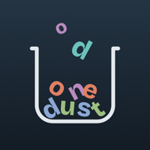

<div align="center">



# Done Dust

*Finished tasks don't vanish. They fall apart, one letter at a time,<br>
and settle into a glass jar you can tilt, shake and poke.*


<br>




</div>

---

## 🫙 The idea

A to-do list usually forgets what you did. Done Dust keeps it.

Check a task and its words crumble into letters. They tumble, collide and
come to rest in a jar at the bottom of the screen. Each day has its own
mineral colour, so over a week the pile grows in **strata**, like rock.
You can read your week in the layers.

## ✋ How it feels

| | |
|---|---|
| ✅ **Check** | The words break apart and fall. The checkbox swells and fills with today's colour. |
| ↩️ **Uncheck** | The letters lift out of the pile and fly home, one by one, even while you scroll. |
| 📱 **Tilt** | The pile slides with the phone. |
| 👆 **Touch** | Drag a letter and throw it, or tap the pile to scatter it. |
| 💨 **Swipe** | A task blows away sideways, letters and all. (Undo is there.) |
| 🫨 **Shake** | The jar empties into the archive. (Undo here too.) |
| 🎉 **Finish everything** | Coloured dust bursts up from the floor of the jar. |

## 🪨 Weight is meaning

Priority is not a label. It is the **material** the letters are made of.

```
  low      ·  light, bouncy letters        ○  ○  ○
  normal   ·  sand that settles             ●  ●  ●
  high     ·  bold stone, 2.6× the mass     ⬤  ⬤  ⬤   shoves the others aside
```

Important tasks are drawn heavier in the list too. The font weight matches
how heavy the letters are in the jar.

## ✨ Everything else

- 🎯 **Daily goal** — set it from **⋮ → Daily goal** (1, 3, 5 or 10). The
  header reads *"2 of 5 done today"*, a thin bar fills in today's colour,
  and reaching the goal sets off the confetti.
- 📊 **Progress at a glance** — with no goal set, the bar shows how much of
  the list is done.
- 🔥 **Streak** — days in a row with something finished.
- 📅 **Due dates** — *Due today*, *Due tomorrow*, or a red *Overdue*.
  Quick chips for today and tomorrow.
- 🔍 **Search, filter, sort** — find by text; show All / Open / Done; sort by
  newest, priority or due date.
- 📋 **Paste a list** — one task per line, added in order.
- 🧬 **Duplicate** — long-press a row, then *Duplicate*.
- 📈 **Stats** — totals, best day, and a bar per weekday in the jar's colours.
- 🗄️ **Archive** — search it, reopen a task, or swipe one away for good.
- 📎 **Copy list** — a `- [ ]` / `- [x]` checklist on your clipboard.
- 🌗 **Theme** — System, Light or Dark, remembered.
- 🔊 **Sound & vibration** — scaled to impact speed, mixed with your music
  instead of pausing it, and switchable.
- 🔤 **Bangla and emoji safe** — text is split by grapheme cluster, so vowel
  signs stay attached to their letters.
- 💾 **Everything persists**, down to where each letter came to rest.
- 🕊️ **Gentle on motion** — with *reduce motion* on, rows appear without
  animating in.

## 🚀 Run it

```bash
flutter pub get
flutter run
flutter test
```

Flutter 3.19 or newer. No extra Android or iOS permissions.

> Tilt and shake need a real device. On an emulator, use
> **⋮ → Empty the jar** instead of shaking.

## 🔬 Under the glass

The physics started as a 1:1 port of a Jetpack Compose original
(`ParticleController.kt`) and grew from there.

- **8 substeps** per frame: inelastic impulses, tangential friction,
  shoulder slip, floor and wall constraints, settling.
- **A spatial grid** for collisions, instead of comparing every pair, so
  hundreds of letters stay smooth.
- **Mass-weighted impulses**: heavy stone really does push sand aside.
- **Real sleep.** After 0.6 s of calm the frame ticker stops completely. A
  tilt of more than 0.06 wakes it. No frames, no battery drain.
- **A jar with a limit.** Past 600 letters the oldest finished tasks go to
  the archive, so the simulation never chokes.
- **Size-independent saves.** Positions are stored relative to the jar, so
  the pile survives a new screen size.

<details>
<summary><b>Project map</b></summary>

```
lib/
├── main.dart                     Entry point, portrait lock, themes
├── theme.dart                    Palette, weekday strata, type
├── models/todo.dart              Todo + Priority
├── physics/
│   ├── particle.dart             Particle, material, task group, dust
│   ├── spatial_grid.dart         Broad-phase collision grid
│   └── particle_world.dart       Simulation, touch, wind, shake, confetti, save/restore
├── services/
│   ├── motion_sensor.dart        Tilt + shake detection
│   ├── feedback_service.dart     Haptics + sound pool
│   └── storage.dart              shared_preferences JSON store
├── state/todo_store.dart         Tasks, archive, settings, daily goal
└── ui/
    ├── todo_screen.dart          Frame loop, actions, header, list
    ├── todo_tile.dart            Row, animated checkbox, entrance, swipe
    ├── task_text.dart            Text with exact per-grapheme anchors
    ├── particle_layer.dart       Letter painter, jar, touch gate
    ├── stats_sheet.dart          Totals and per-weekday bars
    ├── task_editor_sheet.dart    Add / edit sheet
    └── archive_sheet.dart        Archive list
```

</details>

---

<div align="center">

Typeface: **Bricolage Grotesque**, SIL Open Font License (`assets/fonts/OFL.txt`).<br>
Sound effects are synthesized for this project.<br>
Licensed under the Apache License, Version 2.0, like the original.

<sub>*what you finish doesn't disappear. it settles.*</sub>

</div>
